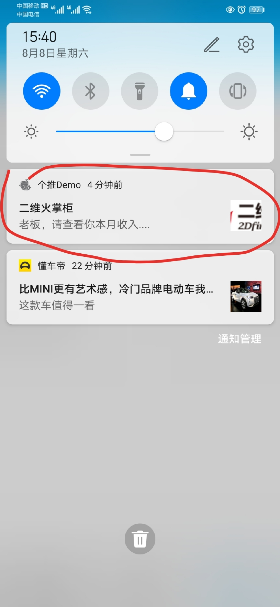

## 个推-Demo

推送功能：在手机通信中，大多智能机都支持推送功能。比如，你手机上有一个即时消息软件，当它在运行时它是和服务器相连的；但是一旦退出后，你就失去了连接。这时推送服务就开始工作了。
程序后台运行时都将会采用这样的一种提醒方式，比如提醒你升级，实时更新消息等。  
  
官方的解释：所谓信息推送，就是"web广播"，是通过一定的技术标准或协议，在互联网上通过定期传送用户需要的信息来减少信息过载的一项新技术。推送技术通过自动传送
信息给用户，来减少用于网络上搜索的时间。它根据用户的兴趣来搜索、过滤信息，并将其定期推给用户，帮助用户高效率地发掘有价值的信息。

---

---
## 一、个推产品
- 消息推送
- 应用数据
- 用户画像
- 短信服务
- 验证服务

---
## 二、竞争对手
- 极光
- 个推（*）
- 百度
- 腾讯信鸽

---
## 三、推送原理
> 各个推送平台的实现都是基于长连接法的   
> Push的使用场景有以下两特点：时间不确定性、时效性

- 个推SDK：以jar的方式出现，集成于第三方客户端，解析第三方下行的数据，并把结果透传给第三方客户端；也可以上行第三方定制的客户端信息。
- 个推服务器：一侧负责维护与成千上万的个推SDK的长时连接，另一侧与第三方服务器对接，将第三方定制数据下行推送至个推SDK。
- 第三方服务器：数据推送的发起者，通过对接个推服务器，将数据发送至第三方客户端。
- 第三方客户端：第三方集成个推SDK的客户端，推送数据正真的接收者和展现者。

###### 整个推送过程的技术流程：
- 第三方客户端集成个推SDK。
- 第三方客户端启动的时候，调用SDK接口，启动推送服务，SDK后台运行并维护和个推服务端的长连接，实现SDK注册和登录。
- 第三方服务端调用个推服务器的接口，将要发送的数据通过个推服务器发送到指定身份的个推SDK当中。
- 个推SDK解析定制数据，并且把第三方服务器透传的数据发送给第三方客户端，第三方客户端根据服务器的数据做出相应的动作或者展现。

---
## 四、技术难点
- 电源管理：sdk服务在后台长期稳定运行
- 网络稳定性
- 性能问题

---
